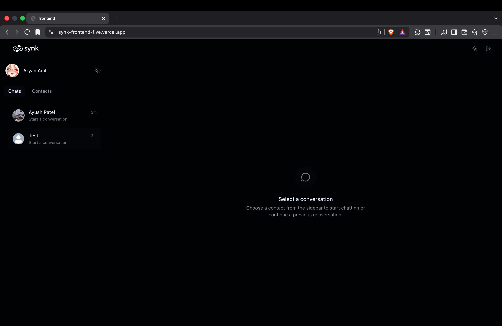
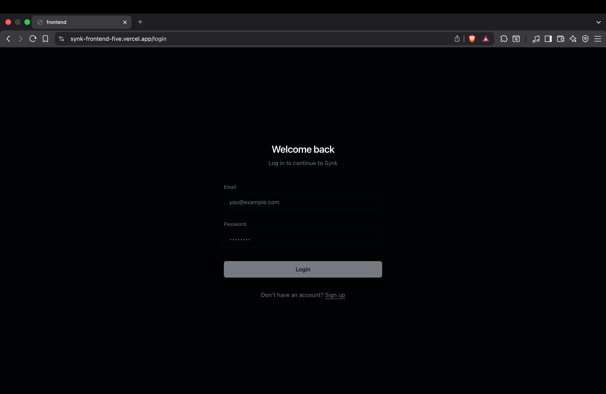
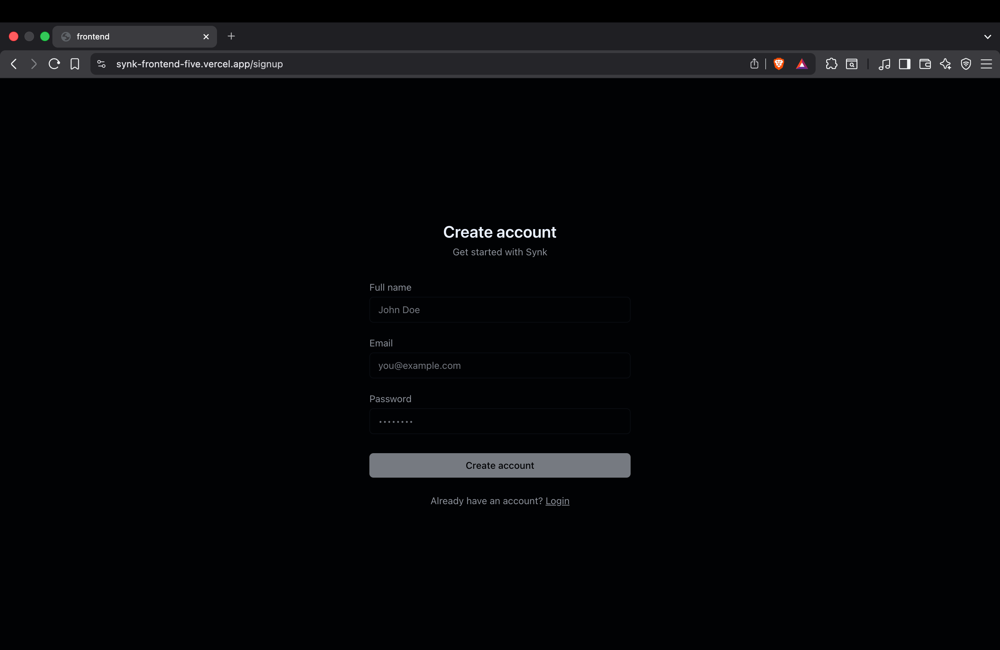
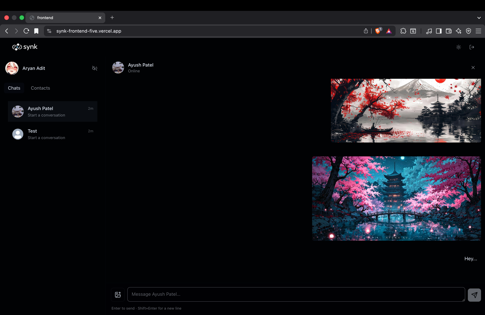

# Synk

A calm, minimal real-time chat app with authentication, online presence, image uploads, and a distraction-free UI.

- **Repo**: `https://github.com/Aryanadit/Synk`
- **Live demo**: `https://synk-frontend-five.vercel.app/`

## Screenshots






## Features

- **Auth**: signup, login, logout (JWT stored in **httpOnly cookie**)
- **Protected chat**: only authenticated users can access `/`
- **Real-time**: Socket.IO for online users + new message events
- **Messaging**: text + optional image attachment
- **Uploads**: media stored in Cloudinary (memory upload, no local filesystem)
- **Email**: welcome email via Resend
- **Security**: CORS + credentials, rate limiting on auth routes

## Tech stack

### Frontend (`frontend/`)

- React 19 + Vite
- Zustand state management
- Tailwind CSS v4 + DaisyUI
- Socket.IO client

### Backend (`backend/`)

- Node.js + Express 5
- MongoDB + Mongoose
- Socket.IO
- Cloudinary (uploads)
- Resend (email)

## Project structure

```text
Synk/
  backend/   # Express + Mongo + Socket.IO API
  frontend/  # React + Vite SPA
  images/    # README screenshots
```

## API overview

Base path is **`/api`**.

### Auth

- `POST /api/auth/signup`
- `POST /api/auth/login`
- `POST /api/auth/logout`
- `PATCH /api/auth/update-profile` (multipart form field: `profilePic`)
- `GET /api/auth/check` (protected)

### Messages (protected)

- `GET /api/messages/contacts`
- `GET /api/messages/partners`
- `GET /api/messages/user/:id`
- `POST /api/messages/send/:id` (multipart form field: `file`, body field: `text`)

### Users

- `GET /api/users` (protected; sidebar users)

## Environment variables

This repo currently doesn’t include `.env.example` files, so here’s the full list inferred from the code.

### Backend (`backend/.env`)

- **`PORT`**: API port (recommended `5050` to match the Vite dev proxy)
- **`NODE_ENV`**: `development` or `production`
- **`CLIENT_URL`**: frontend origin for CORS (e.g. `http://localhost:5173`)
- **`MONGODB_URI`**: Mongo connection string (Atlas recommended)
- **`JWT_SECRET_KEY`**: JWT signing secret
- **`CLOUDINARY_CLOUD_NAME`**
- **`CLOUDINARY_API_KEY`**
- **`CLOUDINARY_API_SECRET`**
- **`RESEND_API_KEY`**
- **`EMAIL_FROM`**: sender email address (must be verified in Resend)
- **`EMAIL_FROM_NAME`**: sender display name

### Frontend (`frontend/.env`)

- **`VITE_API_URL`**: backend API base URL **including `/api`**
  - Local example: `http://localhost:5050/api`
  - Production example: `https://your-backend-domain.com/api`

## Local development

### 1) Backend

```bash
cd backend
npm install

# create backend/.env (see variables above)
npm run dev
```

The server starts on `PORT` (defaults to `3000` in code, but Vite proxy expects `5050`).

### 2) Frontend

```bash
cd frontend
npm install

# create frontend/.env
# VITE_API_URL=http://localhost:5050/api
npm run dev
```

Open the app at `http://localhost:5173`.

## Deployment notes

- **Frontend**: deploy the Vite build from `frontend/`.
- **Backend**: deploy `backend/` as a Node service that supports WebSockets.
- **Cookies + CORS**:
  - Auth cookie is set as `sameSite: "none"` and `secure: true`, so **HTTPS is required**.
  - Set `CLIENT_URL` to your deployed frontend origin.
- **API URL**:
  - Set `VITE_API_URL` to your deployed backend URL ending with `/api`.
  - Socket.IO uses the same base, derived from `VITE_API_URL` (it strips `/api`).

## Troubleshooting

- **CORS / cookie not being set**: make sure you’re on HTTPS in production and `CLIENT_URL` exactly matches the deployed frontend origin.
- **Frontend can’t reach backend in dev**: either set backend `PORT=5050` or update `frontend/vite.config.js` proxy target.

## License

ISC (as currently declared in `backend/package.json`).

